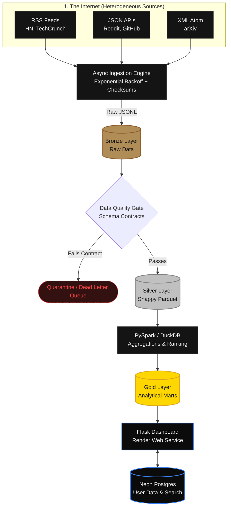

# Sniffer: The Zero-Cost Cloud-Native Data Lakehouse 🐕‍🦺


-brightgreen)


## What is Sniffer?

The tech industry moves faster than anyone can read. Between Hacker News, Reddit, arXiv papers, and a dozen different tech blogs, finding the actual *signal* through the noise is a full-time job. 

**Sniffer is my solution to information overload.** 

It's an automated Data Engineering pipeline that scrapes 7 different tech sources across the web, standardizes the messy data into a clean Data Lakehouse, runs analytical ranking algorithms, and serves the best stories of the day through a **Premium Editorial Web Dashboard**—and it does all of this on a **₹0 / $0 cloud budget**.

---

## 🏗️ How it Works (The Architecture)

I built this project to demonstrate a production-grade **Medallion Lakehouse Architecture**. Here is how data flows from the messy internet to the clean dashboard:



---

## 🌟 Key Engineering Features

1. **Heterogeneous Multi-Protocol Ingestion**: Not all APIs are created equal. Sniffer pulls data simultaneously from RSS, JSON REST APIs, and XML Atom feeds using async Python (`Semaphore(8)`) with built-in retry logic.
2. **Idempotency & Checksumming**: To ensure we never ingest the same article twice (even if the pipeline fails and restarts), every record gets a deterministic SHA-256 fingerprint.
3. **Declarative Data Quality Gate**: Bad data happens. Instead of crashing the pipeline, invalid records are routed to a `quarantine/` folder, while passing records move forward.
4. **Columnar Storage**: Data is saved as Hive-partitioned Snappy Parquet files (`day=YYYY-MM-DD/source=.../`). This compresses data heavily and allows engines like DuckDB to query gigabytes of data in milliseconds.
5. **Dual-Engine Processing**:
   - **PySpark**: Used for heavy distributed transformations and ranking (`DENSE_RANK`).
   - **DuckDB**: Embedded directly in the app to run lightning-fast SQL analytics on the Parquet files.
6. **Premium Editorial UI**: The front-end isn't just a generic template. It features a bespoke, high-contrast dark mode with tactile micro-animations and a slide-out drawer for "Quick Reads" to create a premium reading experience.

---

## 🆓 The ₹0 Infrastructure Setup

Building a Data Lakehouse usually means spending hundreds of dollars on AWS or GCP. I wanted to prove that modern data engineering can be done efficiently on the free tier.

| Component | Technology | Cost |
| :--- | :--- | :--- |
| **Compute / Pipeline** | GitHub Actions (Unlimited public runner minutes) | $0 |
| **Transactional Database**| Neon Serverless PostgreSQL | $0 |
| **Analytics Engine**| DuckDB (Embedded C++ engine, no servers needed) | $0 |
| **Web Hosting** | Render (Free Web Service tier) | $0 |

> **Note on Enterprise IaC**: You will notice an `infrastructure/main.tf` and `sql/athena.sql` file in this repo. While this project runs on a $0 stack, I've included the Terraform code necessary to deploy this pipeline onto a highly-scalable AWS environment (S3, Glue, Athena) to demonstrate enterprise readiness.

---

## 🚀 Quick Start (Run it Locally)

Want to run the pipeline yourself? It's incredibly easy to spin up locally.

### 1. Clone & Install
```bash
git clone https://github.com/DhanushPillay/Web-scraper.git
cd Web-scraper
python -m venv .venv
# Windows:
.\.venv\Scripts\Activate.ps1
# Mac/Linux:
source .venv/bin/activate

pip install -r requirements.txt
```

### 2. Run the Data Pipeline (Bronze ➔ Silver ➔ Gold)
```bash
# This will scrape the web, validate data, and build the Parquet files
python pipeline/run.py
```

### 3. Start the Web Dashboard
```bash
python app.py
# Open http://localhost:7860 to see the UI!
```

---

## 📂 Project Structure

```text
Web-scraper/
├── .github/workflows/       # CI/CD and daily automated scraping
├── dags/                    # Apache Airflow orchestration DAGs
├── data/                    # The Data Lake (Bronze JSONL, Silver/Gold Parquet)
├── doc/                     # Deep-dive technical documentation
├── infrastructure/          # Terraform (AWS Enterprise architecture stubs)
├── pipeline/                # Core ETL logic (ingest, validate, transform)
├── processing/              # PySpark analytical jobs
├── templates/ & static/     # HTML and CSS for the Premium Editorial UI
├── tests/                   # Pytest suite (100% passing)
├── app.py                   # Flask Application
└── database.py              # PostgreSQL / SQLite resilient connection manager
```

---

## 📜 License
Distributed under the MIT License.