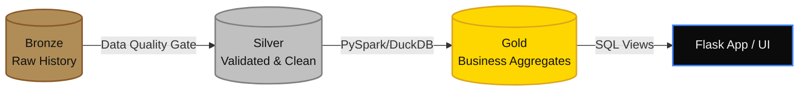
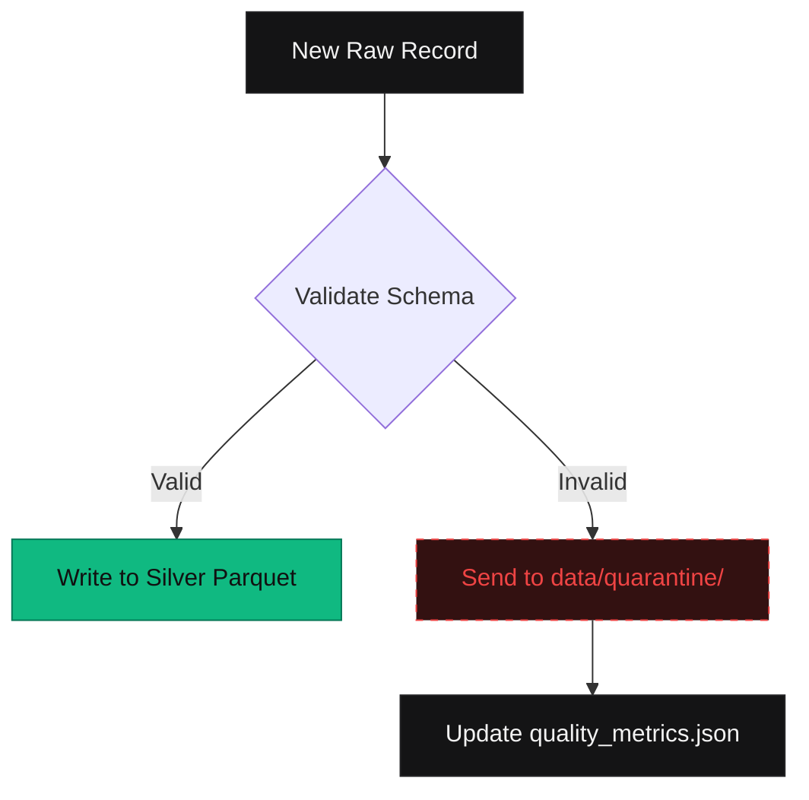

# Technical Deep Dive: Building a Zero-Cost Medallion Lakehouse

This document breaks down the engineering behind **Sniffer**, an automated Tech Intelligence platform. It explains the design decisions, the pipeline stages, and how the platform manages to process thousands of records efficiently without relying on expensive hyperscaler infrastructure.

---

## 1. The Core Philosophy: The Medallion Architecture

Modern data engineering has largely converged on the **Medallion Architecture**, a pattern that logically organizes data into three distinct layers of quality. 

Instead of dumping data straight into a database, data is progressively refined:

1. **Bronze (Raw)**: The history of the world. Data is appended exactly as it was received from the source API.
2. **Silver (Validated)**: Data that has passed schema validation, been deduplicated, and converted into highly-compressed Parquet files.
3. **Gold (Aggregated)**: Business-level metrics, such as calculating "Top 10 articles per category" using window functions.

---

## 2. The Ingestion Engine (Getting the Data)

The internet is messy. Sniffer has to pull data from 7 different sources, and none of them speak the same language. 
- **RSS Feeds**: Hacker News, TechCrunch, The Verge, Ars Technica.
- **REST APIs (JSON)**: Reddit (`/r/technology/top.json`), GitHub Search API (trending repositories).
- **XML Atom API**: arXiv CS research paper repository.

### Making it Resilient
To handle this, the `web_scraper.py` engine uses **Async HTTP** with a bounded concurrency semaphore (`Semaphore(8)`). This ensures we don't accidentally DDOS a source and get our IP banned.

### Idempotency (Never Double-Dipping)
If a pipeline fails halfway through, you need to be able to restart it safely. To prevent ingesting the same article twice, every single record is assigned a deterministic SHA-256 fingerprint the moment it is downloaded:
$$\text{record\_hash} = \text{SHA-256}(\text{source} + ":" + \text{canonical\_link})$$

The Bronze ingestion layer checks this hash before saving. If it exists, it skips it.

---

## 3. The Data Quality Gate (Stopping Bad Data)

You can't trust the internet. Sometimes an API will return a string instead of a number, or an article will be missing a title. If bad data gets into your database, it crashes your app.

Enter `pipeline/validate.py`. Every ingested record is evaluated against a **Declarative Schema Contract**:
- `title`, `link`, and `source` cannot be null.
- The URL must be a valid HTTP/HTTPS string.
- Scores cannot be negative.

Instead of failing the entire pipeline when one bad record is found, the system **quarantines** the bad record into a separate folder for debugging, while the good records proceed.

---

## 4. Columnar Storage & The Dual-Engine Strategy

Once data is clean (Silver), it is saved as **Snappy compressed Parquet files**. Parquet is a columnar storage format, meaning analytics engines can scan gigabytes of data in milliseconds without needing an active database server running.

To process this data into the Gold layer, Sniffer uses a **Dual-Engine strategy**:

1. **PySpark (Distributed Power)**: Used in `processing/spark_job.py`. Spark is the industry standard for big data. We use it to perform heavy window ranking functions, like finding the highest-scored articles per category.
2. **DuckDB (In-Memory Speed)**: Used directly in the Flask application. DuckDB is an embedded C++ analytics engine. It can query our Parquet files instantly, completely eliminating the need to pay for an expensive cloud data warehouse like Snowflake or BigQuery.

---

## 5. Storage & Serving Topology

To keep costs at ₹0 without sacrificing reliability, the storage is split based on the *type* of workload:

| Workload | Technology | Why? |
| :--- | :--- | :--- |
| **Analytical (OLAP)** | Local Hive-Partitioned Parquet + DuckDB | Parquet is highly compressed. DuckDB queries it directly from disk at sub-millisecond speeds. |
| **Transactional (OLTP)** | Neon Serverless PostgreSQL | Neon scales to zero when not in use, making it completely free, but spins up instantly to save user bookmarks. |
| **Failover / Local Dev** | SQLite WAL | If Neon is down, the system gracefully falls back to a local SQLite database in Write-Ahead-Log mode. |

---

## 6. Orchestration & Enterprise Readiness

While the current deployment relies on GitHub Actions (CI/CD) and Render (Web Hosting) to remain free, the project includes the blueprints necessary to deploy to a Fortune 500 environment.

* **Apache Airflow (`dags/`)**: Contains the DAGs required to orchestrate this pipeline on a managed Airflow environment.
* **Terraform (`infrastructure/main.tf`)**: Infrastructure-as-Code scripts that map this pipeline to AWS (deploying to S3 for storage, Glue for cataloging, and Athena for querying). 

This proves that Sniffer isn't just a toy app—it's built on foundational patterns that scale infinitely.
