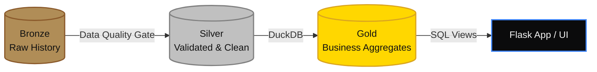
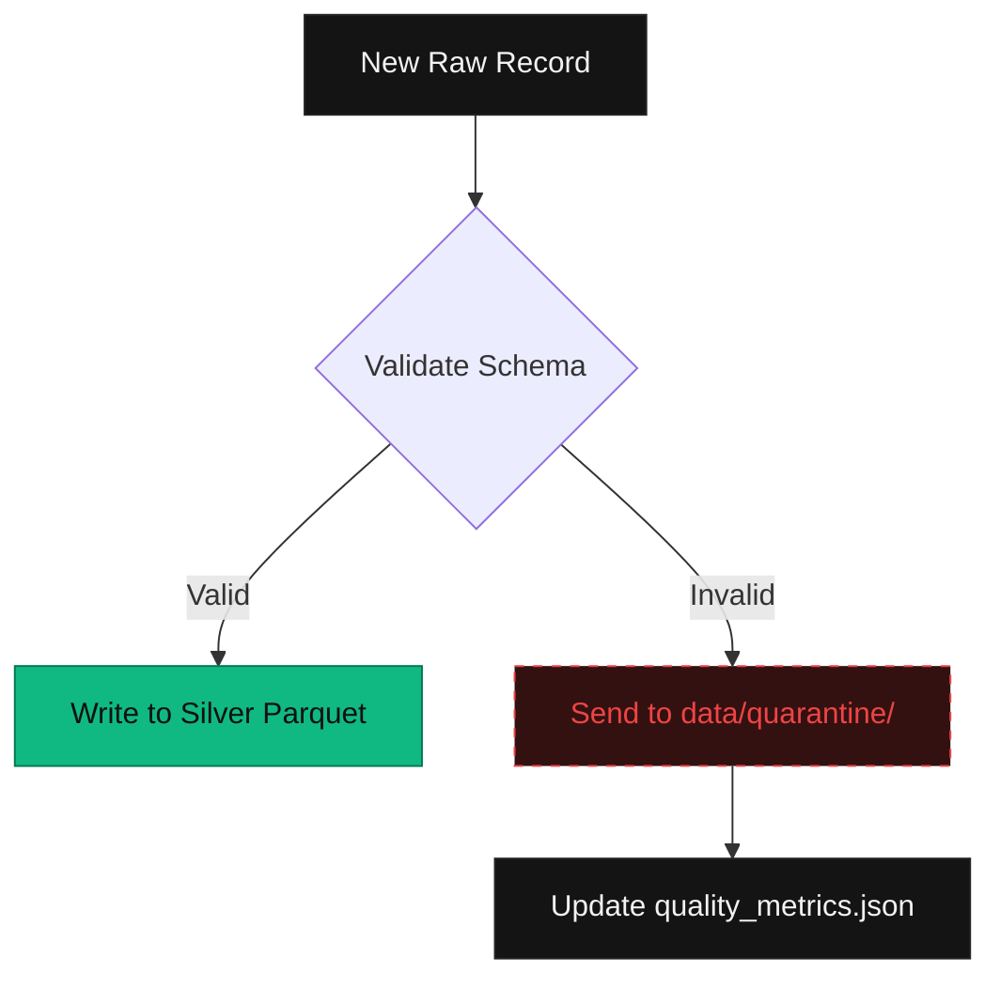

# Technical Deep Dive: Building a Zero-Cost Medallion Lakehouse

This document breaks down the engineering behind **Sniffer**, an automated Tech Intelligence platform. It explains the design decisions, the pipeline stages, and how the platform stays inside a free-tier budget without a hyperscaler data warehouse.

---

## 1. The Core Philosophy: The Medallion Architecture

Modern data engineering has largely converged on the **Medallion Architecture**, a pattern that logically organizes data into three distinct layers of quality. 

Instead of dumping data straight into a database, data is progressively refined:

```mermaid
flowchart LR
    %% Styling
    classDef bronze fill:#b08d57,stroke:#8B5A2B,stroke-width:2px,color:#111
    classDef silver fill:#C0C0C0,stroke:#808080,stroke-width:2px,color:#111
    classDef gold fill:#FFD700,stroke:#DAA520,stroke-width:2px,color:#111
    classDef serve fill:#0B0B0C,stroke:#3B82F6,stroke-width:2px,color:#F2F2F2

    Bronze[(Bronze<br/>Raw History)]:::bronze
    Silver[(Silver<br/>Validated & Clean)]:::silver
    Gold[(Gold<br/>Business Aggregates)]:::gold
    Serve[Flask App / UI]:::serve

    Bronze -- "Data Quality Gate" --> Silver
    Silver -- "DuckDB" --> Gold
    Gold -- "SQL Views" --> Serve
```

1. **Bronze (Raw)**: The history of the world. Data is appended as it was received from the source API, wrapped in an envelope carrying a `record_hash`, `ingested_at` and `schema_version`.
2. **Silver (Validated)**: Data that has passed schema validation, been deduplicated by canonical link, and converted into highly-compressed Parquet files.
3. **Gold (Aggregated)**: Business-level metrics. `processing/spark_job.py` uses DuckDB to write a category mart, a source mart, a `DENSE_RANK()` top-5-per-category ranking and a `daily_stats.json` summary. The module keeps its historical name, but there is no Spark in it.

---

## 2. The Ingestion Engine (Getting the Data)

The internet is messy. Sniffer pulls from 7 sources and none of them speak the same language. 
- **RSS Feeds**: Hacker News (hnrss.org, with an HTML fallback), TechCrunch, The Verge, Ars Technica.
- **REST APIs (JSON)**: Reddit (`/r/technology/top.json`), GitHub Search API (trending repositories).
- **XML Atom API**: arXiv CS research paper repository.

### Making it Resilient
Each scraper is a blocking `requests`/feedparser call, and `scrape_all_async` runs them on threads under one `asyncio.gather` with `return_exceptions=True` (`web_scraper.py:655`). Feed URLs are hardcoded on the scraper classes, not read from a config file: TechCrunch, The Verge and Ars Technica are three one-line subclasses of a generic `RssScraper` (`web_scraper.py:337`, `385`, `397`, `409`).

The per-article `og:image` fan-out is the part that can hammer a host, so it is bounded twice: an `asyncio.Semaphore(8)` around each fetch, and a hard cap of 32 articles per run (`web_scraper.py:627`, `708`). arXiv and GitHub Trending are excluded because they have no article image to find. Set `SNIFFER_MINIMAL=1` to run the 5 core sources without a GitHub token.

### Idempotency (Never Double-Dipping)
If a pipeline fails halfway through, you need to be able to restart it safely. To prevent ingesting the same article twice, every single record is assigned a deterministic SHA-256 fingerprint the moment it is downloaded (`ingest.py:59`):
$$\text{record\_hash} = \text{SHA-256}(\text{source} + ":" + \text{canonical\_link})$$

`canonical_link` is the part that makes the hash stable across the same article arriving by different URLs: IDNA-encoded host, `www.` stripped, default ports dropped, trailing slash removed, query parameters sorted, and the usual tracker parameters deleted (`ingest.py:21`, `32`). The Bronze layer reads the existing hashes for that partition and skips anything already there.

### Crash-safe and concurrency-safe appends
Three failure modes in the append path used to corrupt a partition, and all three are now closed:

* **A concurrent writer interleaving its read and its append.** Each partition takes an `O_CREAT | O_EXCL` lock sentinel before reading, so two writers cannot both see an empty hash set (`ingest.py:117`). A lock whose holder died is reclaimed after 300 seconds, otherwise a crashed run would wedge the partition forever (`ingest.py:29`, `127`).
* **One corrupt line discarding the whole partition.** Hashes are collected line by line, so an unparsable line is logged and skipped instead of raising and making the partition look empty (`ingest.py:102`). The file is also opened with `errors="replace"`, so a mangled byte becomes a bad line rather than a crash (`ingest.py:98`).
* **A truncated last line swallowing the next record.** Before appending, the writer checks the final byte and inserts a newline if a previous crash left none (`ingest.py:187`).

### Honest accounting (the worker must prove its work)

A green CI run only means exit code 0, so the worker is instrumented to make "did nothing" visible:

* **Real insert counts.** `add_articles` inserts with `ON CONFLICT (link) DO NOTHING`, which hides duplicates. It pre-checks existing links in chunked `SELECT`s riding the `UNIQUE` index on `link`, then reports `inserted` from `cursor.rowcount` after the write rather than from a pre-write guess: the pre-check cannot see another session's uncommitted rows, so under `READ COMMITTED` a concurrent insert would otherwise be counted as new (`database.py:455`, `492`). Rows with no `link` are dropped up front and counted as skipped, because they can never satisfy `link TEXT UNIQUE NOT NULL` and used to abort the whole `executemany` while being reported as a duplicate batch (`database.py:440`). A database error re-raises instead of returning `(0, len(articles))`, which was indistinguishable from an all-duplicate batch (`database.py:497`).
* **Fail-loud empty runs.** Zero articles from every source exits 1, because per-scraper failures are already isolated, so all-zero means a systemic outage (`github_scrape.py:152`).
* **Retention runs on every run.** Prune and the metadata drain happen before that exit check (`github_scrape.py:144`). `prune_old_articles` is the only thing that deletes rows, so the old ordering meant a feed outage stopped all cleanup while the cron kept firing.
* **Failures happen before writes.** `ensure_nltk_data` raises if an NLTK resource cannot be downloaded, rather than ignoring `nltk.download`'s `False` and hitting a `LookupError` after the insert had already committed (`github_scrape.py:30`). A broken VADER lexicon aborts the run too, instead of stamping `neutral / 0.0` and setting `metadata_processed_at`, which permanently froze wrong sentiment for those rows (`github_scrape.py:60`).
* **One transaction for the metadata pass.** `update_article_metadata` opens its own connection per call, so the drain was up to 2000 sequential `getconn`/`BEGIN`/`UPDATE`/`COMMIT`/`putconn` round trips. It is now one connection and one `executemany` (`github_scrape.py:92`).
* **Lazy NLTK.** VADER and the NLTK downloads initialize only inside the metadata branch, so empty runs exit before touching them (`github_scrape.py:156`).
* **Phase timings.** Every run logs `Phase scrape / enrich / db-write+prune took …s`, so the hourly cost breakdown is in the logs.

---

## 3. The Data Quality Gate (Stopping Bad Data)

You can't trust the internet. Sometimes an API will return a string instead of a number, or an article will be missing a title. If bad data gets into your database, it crashes your app.

Enter `pipeline/validate.py`. Every ingested record is evaluated against a **Declarative Schema Contract**:
- `title`, `link`, and `source` cannot be null or blank.
- `title` must be between 10 and 500 characters.
- The URL must be a valid HTTP/HTTPS string.
- `score` must be an integer and cannot be negative.
- A canonical link already seen in this batch is a duplicate, so `www.`, a trailing slash or a tracking parameter does not smuggle the same story through twice (`validate.py:23`, `105`).

```mermaid
flowchart TD
    %% Styling
    classDef process fill:#141415,stroke:#242426,stroke-width:1px,color:#F2F2F2
    classDef pass fill:#10B981,stroke:#047857,stroke-width:1px,color:#111
    classDef fail fill:#331111,stroke:#EF4444,stroke-width:1px,color:#EF4444,stroke-dasharray: 5 5

    Record[New Raw Record]:::process --> Gate{Validate Schema}
    Gate -->|Valid| Silver[Write to Silver Parquet]:::pass
    Gate -->|Invalid| Quarantine[Send to data/quarantine/]:::fail
    Quarantine --> Log[Update quality_metrics.json]:::process
```

Instead of failing the entire pipeline when one bad record is found, the system **quarantines** the bad record into a separate folder for debugging, while the good records proceed.

Both observability files are written the same way: into a temp file, then `os.replace`d into position. `data/logs/quality_metrics.json` is the CI quality artifact and `data/quarantine/<day>/quarantined_records.jsonl` is a snapshot of that day rather than an append-only log. Before this, a crash mid-write truncated the metrics file, and re-running a day appended a second copy of every quarantined row (`validate.py:151`, `183`). A file that fails to parse is moved aside with a timestamp rather than silently reset, so the run trend is never quietly erased (`validate.py:174`).

---

## 4. Columnar Storage & the DuckDB Gold Engine

Once data is clean (Silver), it is saved as **Snappy compressed Parquet files** under `data/silver/day=<date>/source=<name>/`. Parquet is a columnar storage format, so an analytics engine can scan a partition without an active database server running.

`to_silver` is idempotent. `pq.write_to_dataset` with `overwrite_or_ignore` writes a new randomly-named file on every call, so re-running a day appended a second copy of every row and the Gold marts counted them again. The writer now wipes the `day=<day>` partitions and writes with `existing_data_behavior="delete_matching"`, so a re-run of the same day replaces it (`transform.py:142`). That is also why the daily workflow pins a `lakehouse-${{ github.ref }}` concurrency group with `cancel-in-progress: false`: a scheduled re-run and a manual dispatch must not race each other on the same partition (`.github/workflows/daily.yml:15`).

The Gold layer is **DuckDB only**. There is no JVM, no cluster and no second engine. `run_gold` loads one Silver partition and builds four outputs (`spark_job.py:77`):

| Output | Contents |
| :--- | :--- |
| `category_metrics.parquet` | article count, average and max score, average sentiment, average read time per category |
| `source_metrics.parquet` | total and average engagement per source |
| `top_ranked_articles.parquet` | `DENSE_RANK() OVER (PARTITION BY category ORDER BY score DESC)`, top 5 per category |
| `daily_stats.json` | totals plus `by_category` / `by_source` breakdowns for the dashboard |

**Gold reads Silver and nothing else.** The old loader fell back to raw Bronze JSONL when DuckDB came back empty, then defaulted every row to `category="general"`, so a missing Silver partition produced a valid-looking but entirely wrong category mart while the run logged success. Bronze records carry no category, sentiment or read_time, so the fallback is gone: an empty partition raises (`spark_job.py:24`, `70`, `170`). If DuckDB itself fails, the retry is still a pyarrow read of the same Silver partition, with `union_by_name=true` so days written by different code versions bind as one schema (`spark_job.py:36`).

---

## 5. Storage & Serving Topology

To keep costs at ₹0 without sacrificing reliability, the storage is split based on the *type* of workload:

| Workload | Technology | Why? |
| :--- | :--- | :--- |
| **Analytical (OLAP)** | Local Hive-Partitioned Parquet + DuckDB | Parquet is highly compressed. DuckDB queries it directly from disk at sub-millisecond speeds. |
| **Transactional (OLTP)** | Neon Serverless PostgreSQL | Neon scales to zero when not in use, making it completely free, but spins up instantly to save user bookmarks. |
| **Failover / Local Dev** | SQLite WAL | If Neon is unreachable, the web app falls back to a local SQLite database in Write-Ahead-Log mode. The hourly worker explicitly opts out of this: with `SNIFFER_REQUIRE_POSTGRES=1` it raises instead, because a runner-local SQLite file dies with the ephemeral runner, which is a green run with zero durable effect. |

Three details in the Postgres path are worth naming, because each was a live bug:

* **Pool sizing.** `SNIFFER_PG_POOL_MIN` defaults to 4, which is the gunicorn `--threads 4` in `render.yaml`. psycopg2's `_putconn` only recycles a connection back into the pool while `len(pool) < minconn`, so `minconn=1` closed roughly 90% of returned connections and forced a fresh TCP and TLS handshake to Neon on nearly every request (`database.py:20`, `91`).
* **Failover is per request, not per process.** A connection-acquisition failure used to set `_use_postgres = False` permanently, pinning that worker to a local file for the life of the process while its sibling kept using Postgres. The downgrade is now scoped to the request that hit the error (`database.py:145`).
* **Timestamps are `DOUBLE PRECISION`.** PostgreSQL `REAL` is float4, whose 24-bit mantissa quantises a current epoch to 128-second steps, which then made `created_at < cutoff` prune in coarse jumps. `created_at` and `metadata_processed_at` are declared as `DOUBLE PRECISION` on Postgres (`database.py:253`).

---

## 6. Orchestration & Enterprise Readiness

The live deployment is GitHub Actions plus Render, which is what keeps the bill at zero. The rest of the repository is portfolio material showing the same pipeline mapped to managed infrastructure. None of it runs in the free stack.

* **Apache Airflow (`dags/`)**: A five-task DAG (pre-flight, Bronze, quality gate, Silver, Gold) for a managed Airflow environment, with retries, a 15-minute execution timeout and `max_active_runs=1`. The pre-flight task now raises when zero of the three checked feeds are reachable. A `PythonOperator` that returns `False` is a *successful* run, so the old `return False` let a total outage walk straight through the gate (`tech_intelligence_lakehouse_dag.py:47`).
* **Terraform (`infrastructure/main.tf`)**: Maps the pipeline onto S3 (with lifecycle rules for Bronze and quarantine), a Glue catalog database, an Athena workgroup capped at 500 MB scanned per query, and a read-only IAM policy for `silver/*` and `gold/*`.
* **Athena SQL (`sql/athena.sql`)**: Section 1 is now live Glue DDL rather than a comment block, declaring all 18 Silver columns (16 data columns plus the `day` and `source` partition keys), with `bullets` as `ARRAY<STRING>` and `credibility` as a JSON string. All three Section 2 queries read with `union_by_name=true`. The paths in Section 2 are local; swap in the `s3://` LOCATION from Section 1 to run them in Athena, no SQL change needed.

---

## 7. The Serving Layer

The Flask app is the only live consumer of the lake, and most of its correctness work is about not serving a wrong answer quietly.

* **Gold stats are reachable.** The dashboard's Gold lookup read `data/gold/**/*.parquet`, a glob spanning `by_category`, `source_metrics` and `top_ranked_articles`. Those three schemas are mutually incompatible, so DuckDB bound the alphabetically-first file and raised, and a bare `except` swallowed it: Gold stats were permanently unreachable from the UI. The query now reads only `data/gold/*/source_metrics.parquet` with `union_by_name=true` (`app.py:250`).
* **Stats are actually cached.** `get_cached_stats()` checked the 60-second TTL *after* the Gold lookup ran, so every page load did an `hf_hub_download`, a glob and a parquet scan, with no negative caching for a miss. The Gold lookup now sits behind the same TTL as the database fallback (`app.py:275`).
* **Search rejection is a rejection.** `sanitize_keyword` returns `None` for a query outside the allowlist, which the route turns into a 400. It used to return `''`, which is falsy, so the `if keyword:` guard dropped the `WHERE` clause and served the entire unfiltered feed as "search results" for anything containing `%`, a quote or an emoji (`app.py:309`, `545`).
* **Rate limits add up.** `flask-limiter` defaults to `override_defaults=True`, so the per-route decorators were *replacing* the global 200/hour rather than adding to it: `/api/summarize` was effectively 1200 outbound fetches per hour. The shared helper passes `override_defaults=False` (`app.py:741`). The 429 handler derives `Retry-After` from the breached limit's reset time, because flask-limiter 3.8 never populates `retry_after` (`app.py:1111`).
* **`/api/summarize` cannot be used as an SSRF pivot.** The `trafilatura.fetch_url` fallback is reachable only from a `requests` transport error. It used to be reachable from the `is_safe_url` path too, so a URL that failed validation was re-fetched with no validation at all. The response is streamed and capped at 500 KB after a content-type check, the post-redirect URL is re-validated, and errors return a generic message rather than the driver text, which carries DSNs and hostnames (`app.py:870`).
* **`/api/email/digest` is opt-in.** Unauthenticated it was an open relay from the app's own domain. It now requires `ALLOW_EMAIL_DIGEST=1` and is limited to 5/hour (`app.py:1025`).
* **The SSE scrape cannot cross-contaminate.** `/api/scrape` accumulates into a local list and only assigns to the process-wide aggregator after the database write succeeds, so two concurrent scrapes no longer interleave and a disconnect no longer leaves a half-finished list for `index()` to persist. The generator reads `add_articles`' return and emits an `error: true` event when articles were found but 0 rows were inserted, and `app.js` surfaces that instead of redirecting to an unchanged feed. The overlay has an explicit Close button (`app.py:645`, `703`; `app.js:135`).
* **The CSP can be strict.** All inline `onchange`/`onerror` handlers moved into `app.js`, so `script-src` is `'self'` with `script-src-attr 'none'`. The topic-chip and source-name lists in `src/templates/index.html` are Jinja macros over a single `` each, and the service worker cache (`sniffer-v5`) has to be bumped together with the `?v=5` query the template requests (`app.py:144`; `index.html:14`, `24`; `service-worker.js:4`).

---

## 8. Environment Variables

| Variable | Effect |
| :--- | :--- |
| `DATABASE_URL` | Postgres DSN. Empty means local SQLite. |
| `SNIFFER_REQUIRE_POSTGRES` | `1` makes an unreachable database fatal instead of a silent fallback. |
| `SNIFFER_PG_POOL_MIN` / `SNIFFER_PG_POOL_MAX` | Postgres pool bounds, default 4 and 10. `MIN` should be at least the gunicorn thread count. |
| `TRUSTED_HOSTS` | Comma-separated host allowlist. Only meaningful on Flask 3.1+, which is why `requirements.txt` pins `flask>=3.1.0`: on 3.0.3 `TRUSTED_HOSTS`, `MAX_FORM_MEMORY_SIZE`, `MAX_FORM_PARTS` and `SECRET_KEY_FALLBACKS` were silently ignored. |
| `SECRET_KEY` / `SECRET_KEY_FALLBACKS` | Session key and rotation keys. |
| `ALLOW_EMAIL_DIGEST` | `1` enables `/api/email/digest`. Off by default. |
| `RETENTION_DAYS` | Row retention for `prune_old_articles`, default 2. |
| `SNIFFER_MINIMAL` | `1` runs the 5 core sources and skips GitHub Trending and arXiv. |
| `RATE_LIMIT_STORAGE` | `memory://` by default; a `redis://` URI needs the `redis` package. |
| `ALLOWED_ORIGINS` | CORS allowlist. Unset means CORS is off. |
| `HF_DATASET` | Optional Hugging Face dataset used only as a stats fallback when no local Gold partition exists. |
| `GITHUB_TOKEN` | Raises the GitHub Search API limit. |

`render.yaml` and the `Dockerfile` both start gunicorn with `--timeout 300`, because an SSE scrape holds a worker for the whole stream and the 30-second default would kill it mid-run and discard the scrape.
